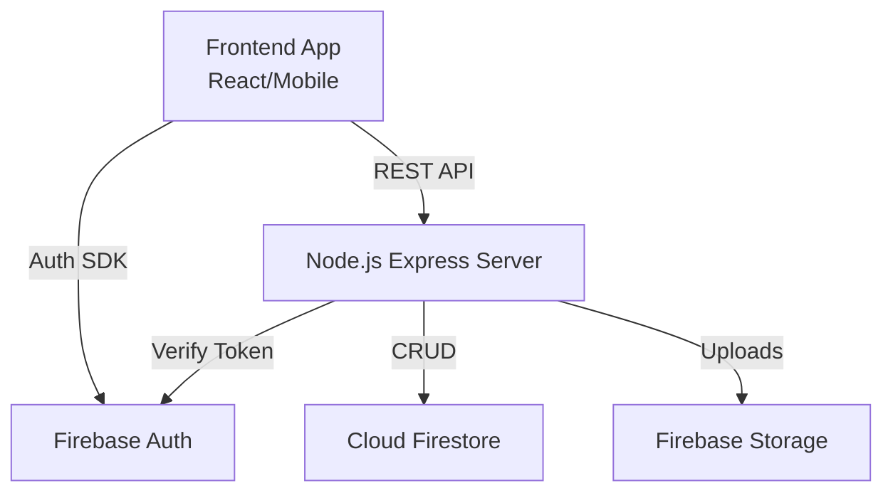

# System Architecture & Frontend Integration Guide

This document outlines the architecture, data flows, and integration patterns for the Advanced Tracking System (Lost & Found). It is designed to guide the Frontend Team in building the UI/UX.

---

## 1. High-Level Architecture

The system follows a standard **Client-Server** architecture with **Firebase** acting as a hybrid database and authentication provider.



### Key Components
- **Frontend**: Handles UI, user inputs, and direct interaction with Firebase Auth (for login/signup).
- **Backend API**: The source of truth. Handles business logic (validations, claims processing, admin actions) and interacts with Firestore.
- **Firebase Auth**: Handles identity management (Google Sign-In, Email/Password).
- **Firestore**: NoSQL database for storing Items, Claims, Users, and Audit Logs.

---

## 2. Authentication Flow

We use a **Hybrid Auth Pattern**:
1.  **Frontend**: Uses Firebase Client SDK to sign in the user.
    *   *Result*: Frontend gets a Firebase `idToken` (JWT).
2.  **API Requests**: Frontend attaches this token to *every* request in the header.
    *   `Authorization: Bearer <idToken>`
3.  **Backend**: Middleware (`auth.middleware.js`) verifies the token with Firebase Admin SDK.
    *   If valid: `req.user` is populated (uid, email, role).
    *   If invalid: `401 Unauthorized`.

> **Frontend Dev Note**: You *must* implement a mechanism to refresh the token (using `getIdToken(true)`) before making API calls if the session is old, though Firebase SDK handles this mostly automatically.

---

## 3. Core Workflows & Data Flow

### A. Reporting an Item (Lost/Found)
1.  **User** fills a form (Title, Type, Location, Description).
2.  **Frontend** calls `POST /api/items`.
3.  **Backend** validates and creates a "Pending" item in Firestore.
    *   *Optional*: User uploads an image via `POST /api/items/:id/image`.
    *   **Note**: Image upload requires base64 string.

### B. The Claims Process (Complex)
This is the heart of the application.

1.  **Discovery**: User views items (`GET /api/items`).
2.  **Claiming**: User clicks "Claim This Item".
    *   **Frontend** calls `POST /api/claims` with `itemId`.
    *   **Backend** checks for duplicates and creates a claim.
3.  **Verification (Chat)**:
    *   A chat room is created for every claim.
    *   **Frontend** polls `GET /api/claims/:id/chat` or sends messages via `POST`.
    *   Admins can request proof (`isProofRequest: true`).
4.  **Decision**:
    *   Admin reviews `GET /api/admin/claims/pending`.
    *   Admin calls `Approve` or `Reject` endpoints.
    *   **Impact**:
        *   *Approve*: Item status -> `returned`. Claim status -> `approved`.
        *   *Reject*: Claim status -> `rejected`. Item remains available.

### C. Admin Dashboard
Admins have specific endpoints that regular users cannot access (`RBAC`).
-   **Analytics**: Global stats (`GET /api/admin/analytics`).
-   **Audit**: Every action (Approve/Reject) is logged in `audit_logs` collection.

---

## 4. API Response Structure

All API responses follow a strict envelope format to simplify frontend parsing.

**Success Response (200/201)**
```json
{
  "success": true,
  "message": "Optional success message",
  "data": { ...object or array... }
}
```

**Error Response (4xx/5xx)**
```json
{
  "success": false,
  "message": "User friendly error message",
  "error": "Detailed technical error (optional, dev mode only)"
}
```

---

## 5. Frontend Implementation Checklist

### 🛑 Authentication
- [ ] Initialize Firebase App in Frontend.
- [ ] Implement Login Screen (Email/Password).
- [ ] Create an Axios/Fetch interceptor to inject `Authorization: Bearer <token>` header.
- [ ] Handle `401 Unauthorized` by redirecting to Login.

### 📦 Items & Discovery
- [ ] **Home Feed**: Fetch items from `GET /api/items`.
- [ ] **Filter**: Client-side or Query param filtering (e.g., `?type=lost`).
- [ ] **Report Form**: Multi-step form (Details -> Upload Image).

### ✋ My Claims
- [ ] **Dashboard**: View `GET /api/claims/my`.
- [ ] **Status Badge**: Show 'Pending', 'Approved', 'Rejected' colors.
- [ ] **Chat UI**: A simple chat interface for `GET/POST /api/claims/:id/chat`.

### 🛡️ Admin Panel (Role Based)
- [ ] **Guard**: Check if `user.role === 'admin'` before showing this section.
- [ ] **Pending List**: Table of claims needing review.
- [ ] **Action Buttons**: Approve/Reject with confirmation modal (optional remarks).

---

## 6. Endpoints Reference

| Feature | Method | Endpoint | Payload | Description |
|---|---|---|---|---|
| **Auth** | POST | `/api/auth/login` | `{campusId, password}` | Login & get user details |
| **Profile** | GET | `/api/users/profile` | - | Get current logged in user |
| **Items** | GET | `/api/items` | `?type=lost` | Get all items |
| **Items** | POST | `/api/items` | `{title, type...}` | Report item |
| **Img** | POST | `/api/items/:id/image` | `{image: "base64.."}` | Upload Item Image |
| **Claims** | POST | `/api/claims` | `{itemId}` | Submit a claim |
| **Claims** | GET | `/api/claims/my` | - | Get user's history |
| **Chat** | GET | `/api/claims/:id/chat` | - | Get messages |
| **Chat** | POST | `/api/claims/:id/chat` | `{content}` | Send message |
| **Admin** | GET | `/api/admin/claims/pending`| - | Queue for admins |
| **Admin** | POST | `/api/admin/claims/:id/approve` | `{remarks}` | Approve claim |
